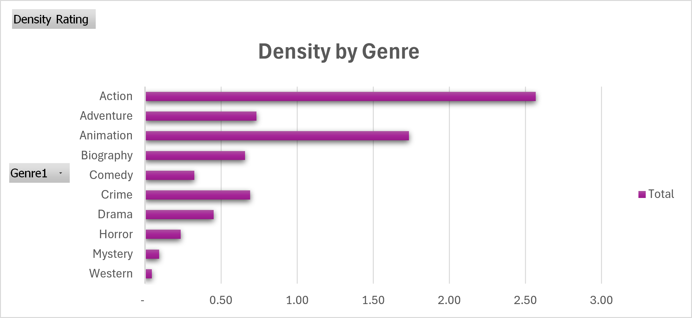
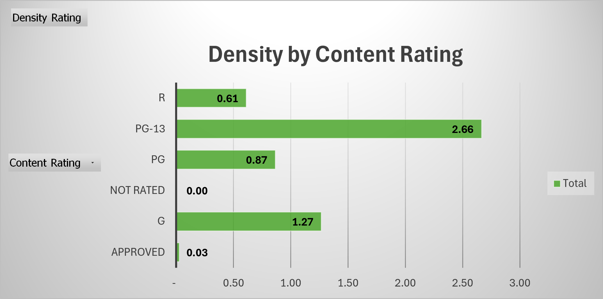
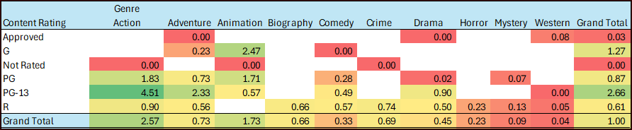

# IMDB Top 100 — Box Office Performance Analysis

An Excel-based data cleaning and pivot table analysis exploring which content ratings and genres drive disproportionate revenue among elite films.

**Author:** Jeffrey Symons · [LinkedIn](https://linkedin.com/in/jeffsymons) · [GitHub](https://github.com/txaggie7295)

---

## Business Question

If a studio is deciding where to deploy production capital, **which combinations of content rating and genre deliver disproportionate box office returns?**

Among elite films, certain categories punch far above their weight. Quantifying that "density of return" lets a studio move beyond raw revenue or raw movie counts and ask the more useful question: *for every movie greenlit in this category, what is the expected revenue share?*

Supporting questions:
- Which genres are most commercially efficient on a per-film basis?
- Does the MPAA content rating decision materially affect commercial ceiling?
- Are there genre + rating combinations that compound, producing outsized returns?

---

## Dataset

The source file (`messy_IMDB_dataset.csv`) is a list of 100 top-rated IMDB films with 12 fields per record. It was selected specifically because it replicates the data quality problems analysts encounter in production environments:

- Non-standard semicolon delimiter
- Mixed character encoding (Latin-1 with corrupted special characters in headers)
- Inconsistent date formats across rows
- Numeric fields contaminated with text, OCR errors, and placeholder values
- Categorical fields with typos and inconsistent capitalization
- Multi-value fields (genres, directors) embedded inside single columns

The 100-row size is small enough to inspect manually for validation but rich enough to exercise nearly every standard cleaning technique.

---

## Data Cleaning

Cleaning was performed in Excel using **Data → Get Data → From Text/CSV** for the import (with semicolon delimiter and UTF-8 encoding), followed by a column-by-column repair using `NUMBERVALUE`, `DATEVALUE`, `Text to Columns`, and manual edits where automation was not viable. Missing values were supplemented by direct lookup against IMDB.com rather than discarded. A full **Data Dictionary** documenting every transformation is included as a tab in `IMDB_Cleaned.xlsx`.

### Issues Identified and Resolved

**Structural**
- File imported as semicolon-delimited, preserving multi-genre and comma-containing title fields (e.g., *Il buono, il brutto, il cattivo*).
- Empty placeholder column between Director and Income removed.
- One fully blank record removed.
- Corrupted header row (encoding artifacts like `Original titlÊ`) retyped with clean column names.

**Release Year**
- Source contained at least seven different date formats: `1995-02-10`, `09 21 1972`, `22 Feb 04`, `23rd December of 1966`, `10-29-99`, `01/16-03`, and others. Standardized using `DATEVALUE` against the `yyyy-mm-dd` format.

**Duration**
- Removed text contamination (`Nan`, `Inf`, `NULL`, `Not Applicable`, `-`, stray characters like `178c`) using `NUMBERVALUE`.
- For records with no recoverable duration value, the runtime was sourced directly from IMDB.com and filled in rather than left blank — preserving full record completeness.

**Country**
- Standardized variants: `US` → `USA`, `New Zesland` → `New Zealand`, `New Zeland` → `New Zealand`.

**Content Rating**
- Several records had `#N/A` or missing ratings. Each was cross-referenced against IMDB.com to obtain the correct value.
- Variants of unrated content (blank, `Unrated`, missing) were consolidated under a single `Not Rated` category for cleaner pivot analysis.

**Income**
- Stripped currency symbols and whitespace, converted with `NUMBERVALUE`.
- Corrected character substitutions — most notably `$ 4o8,035,783` → `408,035,783` (the letter "o" replacing a zero, a classic OCR artifact).

**Votes**
- Source used European-style dot separators (`2.278.845`). Converted to plain integers via multiplication and manual correction of edge cases.

**Score**
- The noisiest column. Issues included trailing decimals (`9.`), comma decimals (`9,.0`), embedded letters (`8,9f`), leading zeros (`08.9`), double decimals (`8..8`), wrong delimiter (`8:8`), leading symbols (`++8.7`), trailing decimals (`8.7.`), and scientific notation fragments (`8,7e-0`). Repaired with a combination of `NUMBERVALUE` and row-level manual correction.

**Genre and Director**
- Multi-value fields split into separate columns (Genre1, Genre2, Genre3; Director1, Director2) using `Text to Columns` with comma delimiter, enabling category-level pivot analysis.

---

## Methodology: The Density Metric

Traditional analysis of this data would ask either "which genre appears most often?" (a count question) or "which genre earned the most?" (a revenue question). Neither alone is useful: Drama appears in 25% of films but contributes only 11% of income, while Action appears in 19% of films but contributes 49%. Counts mislead and totals obscure.

To make these comparable, I built a **Density Rating**:

> **Density = (% of Total Income) ÷ (% of Total Movies)**

A density of 1.0 means the category contributes its proportional share of revenue. Values above 1.0 indicate categories that punch above their weight; values below 1.0 indicate underperformers relative to their representation in the dataset.

All densities are calculated against the full 100-movie dataset baseline so that values are directly comparable across the genre, rating, and combination views.

---

## Key Findings

### 1. Genre Performance

| Genre | % of Movies | % of Income | Density |
|---|---:|---:|---:|
| Action | 19% | 48.8% | **2.57** |
| Animation | 9% | 15.6% | **1.73** |
| Adventure | 7% | 5.1% | 0.73 |
| Crime | 16% | 11.1% | 0.69 |
| Biography | 6% | 3.9% | 0.66 |
| Drama | 25% | 11.3% | **0.45** |
| Comedy | 10% | 3.3% | 0.33 |
| Horror | 2% | 0.5% | 0.23 |
| Mystery | 3% | 0.3% | 0.09 |
| Western | 3% | 0.1% | 0.04 |

**Headline:** Action carries the box office. Animation is the only other meaningful overperformer. Drama — the most common genre in elite films — is one of the least commercially efficient on a per-title basis. The most-frequent genre is not the most-profitable genre.

### 2. Content Rating Performance

| Rating | % of Movies | % of Income | Density |
|---|---:|---:|---:|
| PG-13 | 16% | 42.6% | **2.66** |
| G | 8% | 10.1% | **1.27** |
| PG | 17% | 14.7% | 0.87 |
| R | 53% | 32.4% | 0.61 |
| Approved | 3% | 0.09% | 0.03 |
| Not Rated | 3% | 0.003% | 0.001 |

**Headline:** R-rated films dominate by volume but underperform commercially. PG-13 is the inverse — fewer titles, far more revenue per film. The rating decision materially affects commercial ceiling, and the broadest-audience ratings (G and PG-13) capture revenue share well beyond their representation.

### 3. The Effects Compound: Genre × Rating

Cross-tabulating the two strongest performing ratings (G and PG-13) against their constituent genres reveals where revenue truly concentrates:

| Combination | Films | Density |
|---|---:|---:|
| **PG-13 + Action** | 8 | **4.51** |
| G + Animation | 4 | **2.47** |
| PG-13 + Adventure | 1 | 2.33 |
| PG-13 + Drama | 3 | 0.90 |
| PG-13 + Animation | 1 | 0.57 |
| PG-13 + Comedy | 2 | 0.49 |
| G + Adventure | 1 | 0.23 |
| G + Comedy | 3 | 0.004 |
| PG-13 + Western | 1 | 0.0004 |

**Headline:** PG-13 + Action is the modern blockbuster formula, generating 4.5x its proportional share of revenue — meaningfully more than either factor alone (PG-13 at 2.66, Action at 2.57). G + Animation, essentially the Pixar/Disney lane, punches at 2.5x. Outside these two corridors, density falls off sharply; revenue concentration in this dataset is far narrower than the count distribution would suggest.

---

## Limitations

**Selection bias is the single most important caveat for this analysis.** The dataset is approximately the IMDB top 100 — every film is critically acclaimed (scores 7.4 to 9.3). The findings describe revenue patterns *among already-successful films*, not movies in general. The conclusion is not "PG-13 Action films make money" — many fail. The conclusion is "*among films that achieve elite critical reception*, PG-13 Action concentrates the most revenue."

A studio applying these findings should treat the density rankings as guidance for which categories have the highest commercial ceiling conditional on quality, not as a prediction that any individual investment will succeed.

Other limitations:
- Income reflects historical box office without inflation adjustment. Older films are understated relative to newer ones in raw dollars.
- Theatrical revenue only; streaming, home video, and licensing are not captured.
- Multi-genre films are counted in each of their assigned genres, which inflates the count of common secondary genres like Drama.
- The Genre × Rating crosstab focuses on G and PG-13 (the two highest-density ratings). R-rated combinations were not decomposed in this analysis.

---

## Tools

- **Microsoft Excel** — primary analysis environment; data cleaning, pivot tables, charts, density calculations
- **Power Query** (Data → Get Data → From Text/CSV) — file import with explicit delimiter and encoding control

---

## Files in This Repository

- `messy_IMDB_dataset.csv` — original source data, unaltered
- `IMDB_Cleaned.xlsx` — cleaned dataset with **Data Dictionary** tab documenting every transformation
- `IMDB_Analysis.xlsx` — pivot tables, density calculations, and charts built from the cleaned data
- `charts/` — exported charts referenced in this README
- `README.md` — this document

---

## About

Jeffrey Symons is a financial data analyst with 25 years of experience in auto finance and consumer lending. This project was completed as the midterm for the Texas State University Data Analytics Bootcamp.

📧 jeffreyasymons@gmail.com · [LinkedIn](https://linkedin.com/in/jeffsymons) · [GitHub](https://github.com/txaggie7295)
